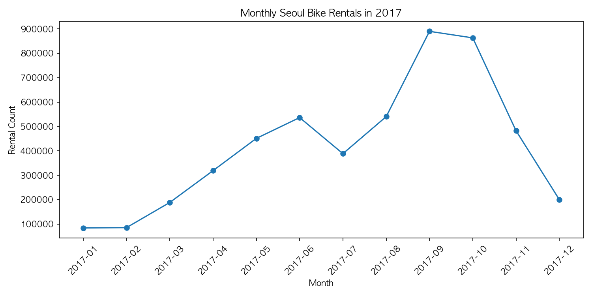
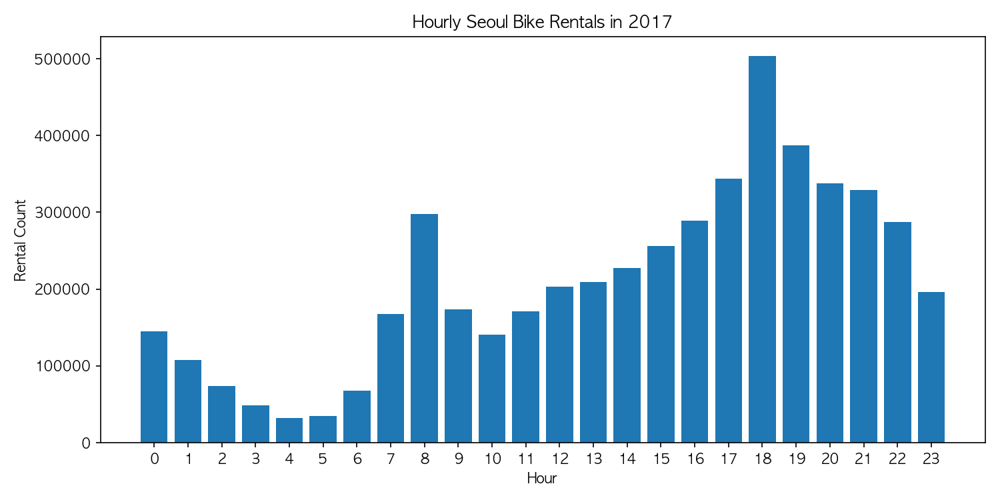
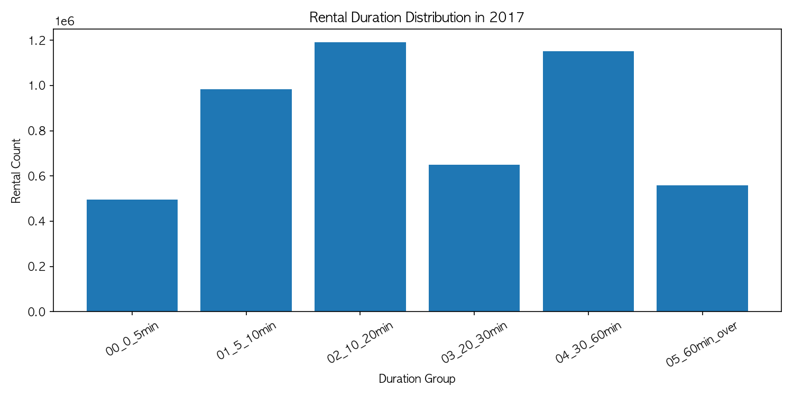
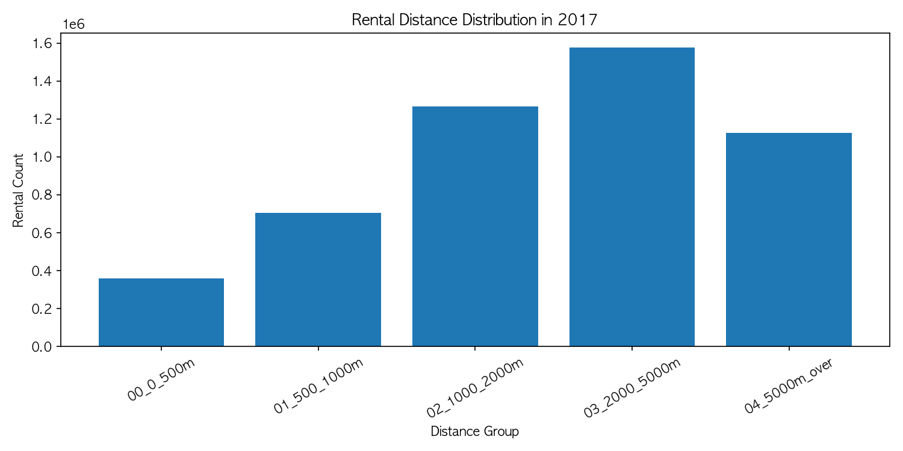

# 서울시 공공자전거 따릉이 이용 패턴 빅데이터 분석

## 1. 문제 정의

### 1.1 분석 배경

서울시 공공자전거 따릉이는 출퇴근, 대중교통 연계, 여가 이동 등에 사용되는 공유 교통수단이다. 따릉이 수요는 계절, 시간대, 대여소 위치에 따라 달라질 수 있으며, 특정 시간대나 특정 대여소에 이용이 집중되면 자전거 부족, 반납 공간 부족, 재배치 비효율과 같은 운영 문제가 발생할 수 있다.

본 프로젝트는 이러한 수요 집중 패턴을 데이터 기반으로 확인하기 위해 서울시 따릉이 대여이력 데이터를 분석하였다.

### 1.2 프로젝트 범위

본 프로젝트는 최신 실시간 수요 예측보다는 Hadoop 기반 대용량 데이터 처리 파이프라인을 구축하고, 2017년 1년치 따릉이 대여이력 데이터를 기준 데이터셋으로 사용하여 이용 패턴을 분석하는 데 초점을 두었다.

2017년 데이터는 1월부터 12월까지 월별 파일이 모두 확보되어 월별 변화 분석에 적합하고, 전체 분석 행 수가 5,030,577건으로 수업의 대용량 데이터 처리 조건을 충족한다. 최신 연도 데이터는 파일 규모가 더 크기 때문에, 이번 프로젝트에서는 먼저 2017년 데이터로 전체 파이프라인을 검증하고 향후 확장 방향으로 최신 데이터 적용을 제시하였다.

### 1.3 분석 질문

1. 월별 따릉이 이용량은 어떻게 변화하는가?
2. 시간대별 따릉이 대여량은 언제 가장 많은가?
3. 대여소별 이용량 Top 10은 어디인가?
4. 이용시간과 이동거리는 어떤 분포를 보이는가?

---

## 2. 시스템 아키텍처

### 2.1 전체 처리 흐름

데이터 처리 흐름은 다음 순서로 구성하였다.

1. 서울 열린데이터광장에서 따릉이 대여이력 CSV 다운로드
2. Mac 로컬에서 월별 CSV 파일 정리
3. GCP VM을 거쳐 HDP Sandbox 로컬 디렉토리로 전송
4. HDFS raw 경로에 원본 CSV 적재
5. CP949 인코딩을 UTF-8로 변환
6. HDFS processed 경로에 변환 CSV 적재
7. Hive External Table 생성
8. Spark DataFrame으로 집계 분석
9. HDFS results 경로에 분석 결과 저장
10. 결과 CSV를 Mac 로컬로 복사
11. Matplotlib으로 시각화

### 2.2 주요 저장 경로

| 구분 | 경로 |
|---|---|
| HDFS raw 데이터 | /user/maria_dev/seoul_bike/raw |
| HDFS processed 데이터 | /user/maria_dev/seoul_bike/processed |
| HDFS 분석 결과 | /user/maria_dev/seoul_bike/results/csv |
| 로컬 결과 CSV | results/csv |
| 로컬 시각화 결과 | results/figures |

### 2.3 사용 기술과 역할

| 기술 | 역할 |
|---|---|
| Bash | 파일 전송, HDFS 적재, 인코딩 변환 자동화 |
| HDFS | 원본 데이터, 전처리 데이터, 분석 결과 저장 |
| Hive | HDFS CSV에 테이블 구조 부여 및 데이터 확인 |
| Spark DataFrame | 월별, 시간대별, 대여소별, 분포 집계 |
| Pandas, Matplotlib | Spark 결과 CSV를 이용한 시각화 |
| Git, GitHub | 코드, 결과, 보고서 관리 |

---

## 3. 데이터 수집 방법

### 3.1 데이터 출처

- 데이터 출처: 서울 열린데이터광장
- 데이터명: 서울특별시 공공자전거 대여이력 정보
- 분석 기간: 2017년 1월 ~ 2017년 12월
- 파일 형식: CSV
- 원본 인코딩: CP949
- 변환 인코딩: UTF-8

### 3.2 데이터 규모

| 항목 | 내용 |
|---|---|
| 월별 CSV 파일 수 | 12개 |
| 분석 대상 기간 | 2017년 1월 ~ 12월 |
| 최종 분석 행 수 | 5,030,577건 |
| 데이터 규모 확인 | HDFS 적재 후 `hdfs dfs -du -h` 명령으로 누적 100MB 이상 데이터 확보 확인 |
| GitHub raw 데이터 관리 | 대용량 원본 제외, 샘플과 결과만 관리 |

### 3.3 수집 및 적재 방식

원본 데이터는 공개 데이터 파일을 내려받은 뒤 월별 CSV 파일로 정리하였다. 대용량 원본 파일은 GitHub에 업로드하지 않고, HDP Sandbox 내부에서 HDFS에 적재하였다.

HDFS raw 적재는 `src/ingest/upload_to_hdfs.sh` 스크립트로 수행하였다. 이후 `src/pipeline/convert_encoding.sh`에서 CP949 인코딩을 UTF-8로 변환하고, 변환된 CSV를 HDFS processed 경로에 저장하였다.

---

## 4. 데이터 처리 및 분석 방법

### 4.1 전처리

원본 CSV는 한글 컬럼명과 대여소명이 포함되어 있고 CP949 인코딩으로 저장되어 있었다. Spark와 Hive에서 안정적으로 처리하기 위해 `iconv`를 사용하여 UTF-8로 변환하였다.

전처리 과정에서 수행한 작업은 다음과 같다.

- 2017년 월별 CSV 파일 12개 확인
- CP949 to UTF-8 인코딩 변환
- HDFS processed 경로에 변환 파일 저장
- Spark 분석에서 사용할 날짜, 이용시간, 이동거리 컬럼 타입 변환

### 4.2 Hive 테이블 생성

Hive에서는 HDFS processed 경로에 저장된 CSV 파일을 External Table로 연결하였다. 이를 통해 HDFS에 저장된 데이터를 이동하지 않고 SQL 방식으로 조회할 수 있도록 하였다.

사용한 파일은 다음과 같다.

- src/pipeline/create_hive_table.sql

Hive에서 확인한 주요 내용은 다음과 같다.

- CSV 컬럼 구조 확인
- 샘플 데이터 조회
- 전체 행 수 확인

### 4.3 Spark 분석

Spark 분석은 `src/pipeline/spark_analysis.py`에서 수행하였다. Spark DataFrame으로 HDFS processed 경로의 2017년 월별 UTF-8 CSV 전체를 읽고, 분석에 필요한 컬럼을 변환한 뒤 집계를 수행하였다.

분석 항목은 다음과 같다.

| 분석 항목 | 처리 방식 |
|---|---|
| 월별 이용량 | 대여일시에서 월을 추출한 뒤 groupBy, count |
| 시간대별 이용량 | 대여일시에서 시간을 추출한 뒤 groupBy, count |
| 대여소별 Top 10 | 대여소 번호와 이름 기준 groupBy, count, 정렬 |
| 이용시간 요약 | 평균, 최소, 최대 계산 |
| 이동거리 요약 | 평균, 최소, 최대 계산 |
| 이용시간 분포 | 구간별 그룹 생성 후 count |
| 이동거리 분포 | 구간별 그룹 생성 후 count |

### 4.4 시각화

Spark 분석 결과는 HDFS에 CSV 형태로 저장하였다. 이후 Mac 로컬의 `results/csv` 경로로 복사하고, `src/analyze/visualize.py`에서 Pandas와 Matplotlib을 이용하여 그래프로 시각화하였다.

생성한 시각화 결과는 다음과 같다.

- 월별 이용량 그래프
- 시간대별 이용량 그래프
- 대여소별 이용량 Top 10 그래프
- 이용시간 분포 그래프
- 이동거리 분포 그래프

---

## 5. 분석 결과

### 5.1 월별 이용량

2017년 월별 이용량은 겨울철에 낮고, 봄 이후 증가하다가 9월에 가장 높게 나타났다.

주요 결과는 다음과 같다.

| 월 | 대여 건수 |
|---|---:|
| 2017-01 | 84,148 |
| 2017-09 | 889,888 |
| 2017-10 | 863,113 |

9월과 10월의 이용량이 높게 나타난 것은 날씨가 자전거 이용에 적합한 시기와 관련이 있을 가능성이 있다. 반면 1월과 2월은 겨울철 영향으로 이용량이 낮게 나타났다.

### 5.2 시간대별 이용량

시간대별로는 18시 이용량이 가장 높았다. 17시부터 20시까지의 퇴근 시간대 이용량이 전반적으로 높고, 8시에도 이용량이 증가하였다.

주요 결과는 다음과 같다.

| 시간 | 대여 건수 |
|---|---:|
| 17시 | 343,836 |
| 18시 | 503,936 |
| 19시 | 387,540 |

이를 통해 따릉이가 출퇴근 시간대의 단거리 이동 수단으로 사용되는 경향을 확인할 수 있다.

### 5.3 대여소별 이용량 Top 10

대여소별 이용량은 여의나루역 1번출구 앞이 가장 높게 나타났다. 상위 대여소에는 한강공원 접근 지점, 지하철역 주변, 유동인구가 많은 지역이 포함되었다.

이 결과는 따릉이 수요가 여가 공간과 대중교통 연계 지점에서 모두 높게 나타날 수 있음을 보여준다.

### 5.4 이용시간 분포

이용시간 분포에서는 10~20분 구간과 30~60분 구간이 많이 나타났다.

| 이용시간 구간 | 대여 건수 |
|---|---:|
| 0~5분 | 495,248 |
| 5~10분 | 984,244 |
| 10~20분 | 1,191,181 |
| 20~30분 | 650,154 |
| 30~60분 | 1,151,374 |
| 60분 이상 | 558,376 |

평균 이용시간은 약 28.59분으로 나타났다.

### 5.5 이동거리 분포

이동거리 분포에서는 2~5km 구간이 가장 많았다.

| 이동거리 구간 | 대여 건수 |
|---|---:|
| 0~500m | 358,118 |
| 500~1000m | 704,634 |
| 1000~2000m | 1,265,986 |
| 2000~5000m | 1,575,642 |
| 5000m 이상 | 1,126,197 |

평균 이동거리는 약 3.62km로 나타났다.

---

## 6. 한계 및 개선 방향

### 6.1 한계

본 분석은 2017년 데이터만 사용했기 때문에 현재 따릉이 이용 현황을 직접 설명하지는 못한다. 따라서 결과를 현재 운영 상황에 그대로 적용하기보다는, 2017년 1년치 데이터를 기준으로 한 이용 패턴 분석으로 해석해야 한다.

또한 날씨, 공휴일, 지하철역 위치, 대여소별 거치대 수와 같은 외부 변수를 결합하지 않았기 때문에 이용량 변화의 원인을 완전히 설명하기는 어렵다. 이용시간과 이동거리에는 일부 이상치가 포함되어 있으며, 이상치 제거 기준을 추가하면 평균값과 분포 해석이 더 안정적일 수 있다.

### 6.2 개선 방향

향후에는 동일한 파이프라인에 2024년 이후 최신 데이터를 적용하여 최근 이용 패턴을 분석할 수 있다. 또한 여러 연도 데이터를 추가하면 연도별 변화와 계절성 변화를 비교할 수 있다.

추가로 날씨 데이터, 공휴일 정보, 지하철역 위치 데이터, 대여소별 거치대 수를 결합하면 수요 변화의 원인을 더 구체적으로 분석할 수 있다. Spark SQL이나 Hive를 활용하여 지역별, 요일별, 성별/연령대별 분석을 추가하는 것도 가능하다.

---

## 7. 참고문헌 및 AI 도구 사용

### 7.1 참고문헌

- 서울 열린데이터광장, 서울특별시 공공자전거 대여이력 정보: https://data.seoul.go.kr/dataList/datasetView.do?infId=OA-15182&serviceKind=1&srvType=A
- Apache Hadoop Documentation
- Apache Hive Documentation
- Apache Spark Documentation
- Matplotlib Documentation
- 빅데이터 프로그래밍 강의자료

### 7.2 AI Tool Usage

- ChatGPT: HDP Sandbox 실행 과정에서 발생한 인코딩, 권한, Spark 실행 오류 디버깅 보조
- ChatGPT: Spark 집계 흐름 점검, 시각화 구성 아이디어, 제출 전 문서 정합성 점검 보조
- 최종 코드 실행과 결과값 확인은 프로젝트 데이터와 직접 실행 결과를 기준으로 수행함
