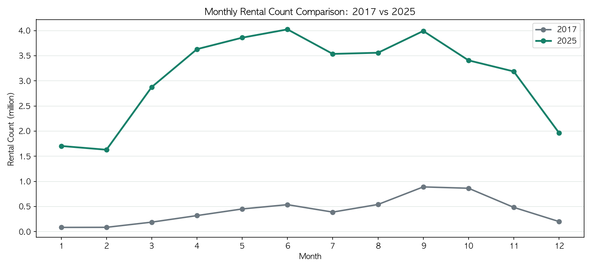
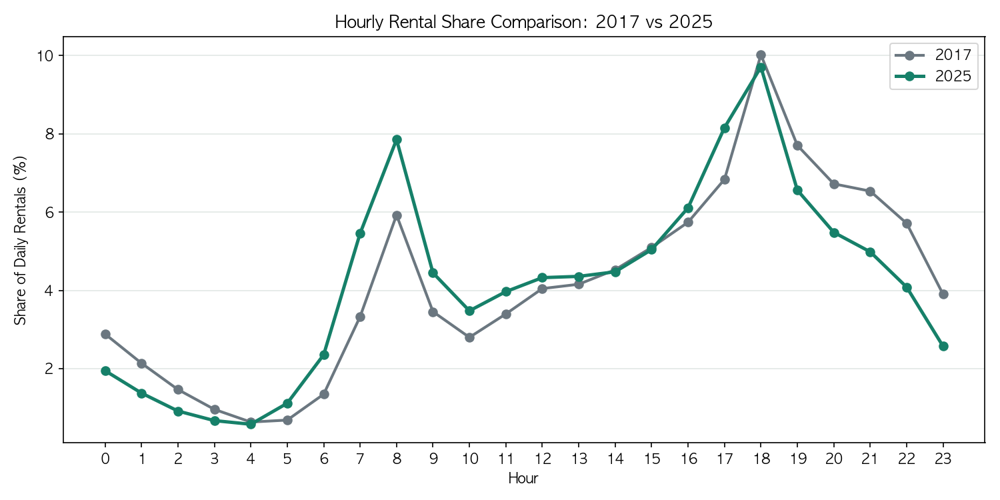
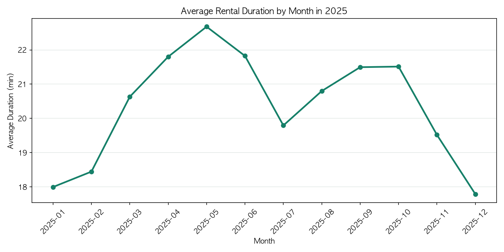
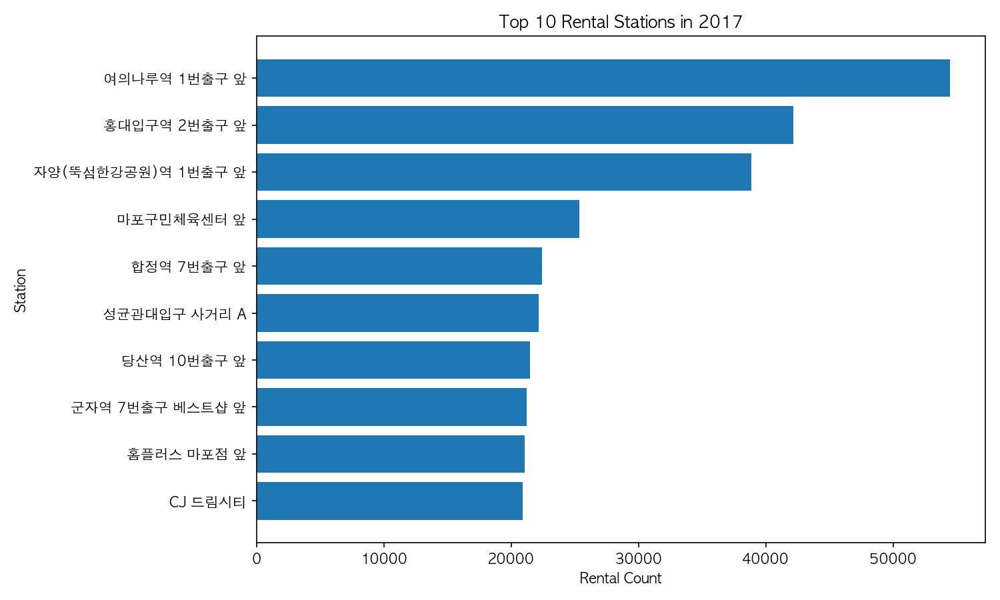

# 서울시 공공자전거 따릉이 이용 패턴 빅데이터 분석

- 학번: 60211652
- 이름: 김원빈

## 1. 문제 정의

### 1.1 분석 배경

서울시 공공자전거 따릉이는 출퇴근, 대중교통 연계, 여가 이동 등에 사용되는 공유 교통수단이다. 최근에는 공유 전동킥보드, 공유 전기자전거와 같은 개인형 이동수단(PM, Personal Mobility)도 함께 확산되면서 서울의 단거리 이동 선택지가 다양해지고 있다.

이러한 변화 속에서 따릉이 이용량이 감소했는지, 아니면 여전히 공공 단거리 교통수단으로 활용되고 있는지 확인할 필요가 있다. 본 프로젝트는 따릉이 대여이력 데이터를 기반으로 월별, 시간대별, 이용시간 및 이동거리 패턴을 분석하여 따릉이의 현재 역할을 해석하였다.

### 1.2 프로젝트 범위

본 프로젝트는 최신 실시간 수요 예측보다는 Hadoop 기반 대용량 데이터 처리 파이프라인을 구축하고, 최신 대여이력 데이터에 적용하여 따릉이 이용 패턴과 역할 변화를 분석하는 데 초점을 두었다.

먼저 2017년 1월부터 12월까지의 데이터를 사용하여 HDFS 적재, 인코딩 변환, Hive External Table 생성, Spark 집계, 시각화까지 전체 파이프라인을 자동화하고 재현성을 검증하였다. 이후 동일한 처리 흐름을 2025년 1월부터 12월까지의 최신 데이터에 확장 적용하였다.

최종 해석은 2025년 데이터를 중심으로 수행하였다. 2025년 데이터는 총 37,372,654건으로 2017년 5,030,577건보다 약 7.43배 크다. HDP Sandbox 환경에서는 전체 12개월을 한 번에 집계할 때 자원 한계가 발생하여, 월별 파일 단위로 Spark 분석을 분할 실행한 뒤 결과를 결합하였다.

공유 PM 확산 여부 자체는 따릉이 대여이력만으로 직접 측정할 수 없으므로, 본 분석은 전동킥보드나 전기자전거가 따릉이 이용량에 미친 인과효과를 증명하는 방식은 아니다. 대신 공유 PM이 늘어난 환경 속에서도 따릉이 이용량과 이용 특성이 어떻게 나타나는지를 확인하고, 따릉이가 생활형 단거리 교통수단으로 성장했는지를 해석하는 방식으로 접근하였다.

### 1.3 분석 질문

1. 2017년과 비교했을 때 2025년 따릉이 전체 이용량은 감소했는가, 증가했는가?
2. 월별 이용량과 비성수기 이용량은 2017년 대비 어떻게 달라졌는가?
3. 시간대별 이용 비중은 2017년과 비교했을 때 생활 이동 성격을 유지하거나 강화했는가?
4. 평균 이용시간과 평균 이동거리는 2017년 대비 어떻게 변화했는가?
5. 공유 PM 확산 환경 속에서도 따릉이는 생활형 단거리 교통수단으로 성장했다고 볼 수 있는가?

---

## 2. 시스템 아키텍처

### 2.1 전체 처리 흐름

데이터 처리 흐름은 다음 순서로 구성하였다.

1. 서울 열린데이터광장에서 따릉이 대여이력 CSV 다운로드
2. Mac 로컬에서 월별 CSV 파일 정리
3. GCP VM을 거쳐 HDP Sandbox 로컬 디렉토리로 전송
4. HDFS raw 경로에 원본 CSV 적재
5. CP949 인코딩을 UTF-8로 변환
6. HDFS processed 경로에 변환 CSV 적재
7. Hive External Table 생성
8. Spark DataFrame으로 집계 분석
9. HDFS results 경로에 분석 결과 저장
10. 결과 CSV를 Mac 로컬로 복사
11. Matplotlib으로 시각화

### 2.2 주요 저장 경로

| 구분 | 경로 |
|---|---|
| HDFS raw 데이터 | /user/maria_dev/seoul_bike/raw |
| HDFS processed 데이터 | /user/maria_dev/seoul_bike/processed |
| HDFS 분석 결과 | /user/maria_dev/seoul_bike/results/csv |
| 로컬 결과 CSV | results/csv |
| 로컬 시각화 결과 | results/figures |

### 2.3 사용 기술과 역할

| 기술 | 역할 |
|---|---|
| Bash | 파일 전송, HDFS 적재, 인코딩 변환 자동화 |
| HDFS | 원본 데이터, 전처리 데이터, 분석 결과 저장 |
| Hive | HDFS CSV에 테이블 구조 부여 및 데이터 확인 |
| Spark DataFrame | 월별, 시간대별, 대여소별, 분포 집계 |
| Pandas, Matplotlib | Spark 결과 CSV를 이용한 시각화 |
| Git, GitHub | 코드, 결과, 보고서 관리 |

---

## 3. 데이터 수집 방법

### 3.1 데이터 출처

- 데이터 출처: 서울 열린데이터광장
- 데이터명: 서울특별시 공공자전거 대여이력 정보
- 분석 기간: 2017년 1월 ~ 12월, 2025년 1월 ~ 12월
- 파일 형식: CSV
- 원본 인코딩: CP949
- 변환 인코딩: UTF-8

공유 PM 관련 데이터는 결론 해석의 배경과 향후 확장 방향을 정리하기 위한 참고 자료로 확인하였다. 서울 열린데이터광장에는 공유 전동킥보드 운영 현황, 전동킥보드 견인 현황, 전동킥보드 주차구역 현황 데이터가 제공되어 있으며, 향후 따릉이 데이터와 결합하면 단거리 공유 모빌리티 관점의 공간 분석으로 확장할 수 있다.

### 3.2 데이터 규모

| 항목 | 2017년 | 2025년 |
|---|---:|---:|
| 월별 CSV 파일 수 | 12개 | 12개 |
| 분석 대상 기간 | 1월 ~ 12월 | 1월 ~ 12월 |
| 최종 분석 행 수 | 5,030,577건 | 37,372,654건 |
| 역할 | 파이프라인 검증 및 비교 기준 | 최종 분석 대상 |

추가 데이터 관리 기준은 다음과 같다.

| 항목 | 내용 |
|---|---|
| 데이터 규모 확인 | HDFS 적재 후 `hdfs dfs -du -h` 명령으로 누적 100MB 이상 데이터 확보 확인 |
| GitHub raw 데이터 관리 | 대용량 원본 제외, 샘플과 결과만 관리 |

### 3.3 수집 및 적재 방식

원본 데이터는 공개 데이터 파일을 내려받은 뒤 월별 CSV 파일로 정리하였다. 대용량 원본 파일은 GitHub에 업로드하지 않고, HDP Sandbox 내부에서 HDFS에 적재하였다.

HDFS raw 적재는 `src/ingest/upload_to_hdfs.sh` 스크립트로 수행하였다. 이후 `src/pipeline/convert_encoding.sh`에서 CP949 인코딩을 UTF-8로 변환하고, 변환된 CSV를 HDFS processed 경로에 저장하였다.

---

## 4. 데이터 처리 및 분석 방법

### 4.1 전처리

원본 CSV는 한글 컬럼명과 대여소명이 포함되어 있고 CP949 인코딩으로 저장되어 있었다. Spark와 Hive에서 안정적으로 처리하기 위해 `iconv`를 사용하여 UTF-8로 변환하였다.

전처리 과정에서 수행한 작업은 다음과 같다.

- 2017년 및 2025년 월별 CSV 파일 확인
- CP949 to UTF-8 인코딩 변환
- HDFS processed 경로에 변환 파일 저장
- Spark 분석에서 사용할 날짜, 이용시간, 이동거리 컬럼 타입 변환

### 4.2 Hive 테이블 생성

Hive에서는 HDFS processed 경로에 저장된 CSV 파일을 External Table로 연결하였다. 이를 통해 HDFS에 저장된 데이터를 이동하지 않고 SQL 방식으로 조회할 수 있도록 하였다.

사용한 파일은 다음과 같다.

- src/pipeline/create_hive_table.sql

Hive에서 확인한 주요 내용은 다음과 같다.

- CSV 컬럼 구조 확인
- 샘플 데이터 조회
- 전체 행 수 확인

추가로 Hive External Table(`rental_2025_raw`)에 대해 HiveQL `GROUP BY` 집계를 직접 수행하여 월별 대여 건수를 산출하였다(12 rows, 약 452초, Tez 엔진). 그 결과는 Spark DataFrame으로 집계한 월별 이용량과 동일하게 나타나, 동일 데이터에 대한 Hive와 Spark 처리의 일관성을 교차검증하였다. 한편 최종 대량 집계는 Spark가 HDFS processed CSV를 직접 읽도록 구성하였는데, 이는 HDP Sandbox의 Ranger 권한 정책상 Spark 실행 계정(maria_dev)의 Hive 메타스토어 접근이 제한되었기 때문이다. 따라서 Hive는 스키마 정의와 집계 교차검증 용도로, Spark는 최종 대량 집계 용도로 역할을 분담하였다.

```sql
SELECT substr(rent_datetime, 1, 7) AS month, COUNT(*) AS cnt
FROM rental_2025_raw
GROUP BY substr(rent_datetime, 1, 7)
ORDER BY month;
```

### 4.3 Spark 분석

Spark 분석은 `src/pipeline/spark_analysis.py`에서 수행하였다. 2017년 데이터는 전체 파이프라인 검증을 위해 12개월 데이터를 한 번에 읽어 집계하였다.

2025년 분석에서는 같은 Spark 분석 스크립트에 입력 경로와 출력 경로를 연도별로 지정할 수 있도록 하였다. 전체 12개월을 한 번에 처리할 때는 Sandbox 자원 한계로 executor timeout이 발생하여, 최종 집계는 월별 파일 단위로 나누어 반복 실행하였다. 이후 `src/analyze/summarize_2025_results.py`에서 월별 결과를 결합하여 2025년 전체 월별 이용량, 시간대별 이용량, 이용시간 및 이동거리 요약을 산출하였다.

분석 항목은 다음과 같다.

| 분석 항목 | 처리 방식 |
|---|---|
| 월별 이용량 | 대여일시에서 월을 추출한 뒤 groupBy, count |
| 시간대별 이용량 | 대여일시에서 시간을 추출한 뒤 groupBy, count |
| 대여소별 Top 10 | 대여소 번호와 이름 기준 groupBy, count, 정렬 |
| 이용시간 요약 | 평균, 최소, 최대 계산 |
| 이동거리 요약 | 평균, 최소, 최대 계산 |
| 이용시간 분포 | 구간별 그룹 생성 후 count |
| 이동거리 분포 | 구간별 그룹 생성 후 count |
| 해석 보조 지표 | 출퇴근 시간대 비중, 계절별 비중, 2017 대비 계절별 증가율 계산 |

### 4.4 시각화

Spark 분석 결과는 HDFS에 CSV 형태로 저장하였다. 이후 Mac 로컬의 `results/csv` 경로로 복사하고, `src/analyze/visualize.py`에서 Pandas와 Matplotlib을 이용하여 그래프로 시각화하였다.

생성한 시각화 결과는 다음과 같다.

- 월별 이용량 그래프
- 시간대별 이용량 그래프
- 대여소별 이용량 Top 10 그래프
- 이용시간 분포 그래프
- 이동거리 분포 그래프

---

## 5. 분석 결과

### 5.1 전체 이용량과 월별 변화

2017년 데이터는 전체 파이프라인 자동화와 재현성 검증을 위해 사용하였다. 같은 분석 흐름을 적용한 결과, 2017년 전체 대여 건수는 5,030,577건이었고, 2025년은 37,372,654건으로 약 7.43배 증가하였다.

월별로 보아도 모든 달에서 2025년 이용량이 2017년보다 높았다. 특히 겨울철은 2017년 대비 약 14.31배 증가하여, 성수기뿐 아니라 비성수기에도 기본 수요가 확대되었음을 확인할 수 있다.

| 월 | 2017년 대여 건수 | 2025년 대여 건수 | 증가 배수 |
|---|---:|---:|---:|
| 1월 | 84,148 | 1,704,188 | 20.25배 |
| 2월 | 85,592 | 1,629,474 | 19.04배 |
| 3월 | 188,734 | 2,876,862 | 15.24배 |
| 4월 | 319,172 | 3,630,749 | 11.38배 |
| 5월 | 451,224 | 3,859,379 | 8.55배 |
| 6월 | 536,522 | 4,024,309 | 7.50배 |
| 7월 | 388,669 | 3,536,197 | 9.10배 |
| 8월 | 540,454 | 3,559,262 | 6.59배 |
| 9월 | 889,888 | 3,992,296 | 4.49배 |
| 10월 | 863,113 | 3,407,800 | 3.95배 |
| 11월 | 482,621 | 3,186,968 | 6.60배 |
| 12월 | 200,440 | 1,965,170 | 9.80배 |



### 5.2 시간대별 이용 비중 비교

시간대 분석은 2025년 단독 결과가 아니라 2017년과의 비교 지표로 해석하였다. 두 연도 모두 18시가 최고 이용 시간으로 나타났고, 18시 대여 건수는 2017년 503,936건에서 2025년 3,627,270건으로 약 7.20배 증가하였다.

8시와 17~19시를 합친 출퇴근 시간대 비중은 2017년 30.5%에서 2025년 32.3%로 약 1.8%p 증가하였다. 특히 8시 비중은 5.9%에서 7.9%로 커져 출근 시간대 이용 성격이 더 뚜렷해졌다.

| 지표 | 2017년 | 2025년 | 변화 |
|---|---:|---:|---:|
| 최고 이용 시간 | 18시 | 18시 | 18시 대여 약 7.20배 |
| 8시 이용 비중 | 5.9% | 7.9% | +1.9%p |
| 17~19시 이용 비중 | 24.6% | 24.4% | 유사한 수준 |
| 8시·17~19시 이용 비중 | 30.5% | 32.3% | +1.8%p |



### 5.3 이용시간과 이동거리 변화

2017년보다 2025년의 평균 이용시간과 평균 이동거리는 모두 짧아졌다. 평균 이용시간은 28.59분에서 20.73분으로 약 27.5% 감소했고, 평균 이동거리는 3.62km에서 2.30km로 약 36.4% 감소하였다.

| 항목 | 2017년 | 2025년 | 변화 |
|---|---:|---:|---:|
| 평균 이용시간 | 약 28.59분 | 약 20.73분 | -27.5% |
| 평균 이동거리 | 약 3.62km | 약 2.30km | -36.4% |

이 결과는 따릉이 이용이 단순히 많이 늘어난 것에 그치지 않고, 생활권 안에서 짧게 이동하는 성격이 더 강해졌다는 해석으로 연결된다. 다만 최대 이용시간과 최대 이동거리에는 이상치가 포함될 수 있으므로 평균 해석에는 주의가 필요하다.



### 5.4 비교 결과 종합

월별 이용량, 시간대별 이용 비중, 평균 이용시간과 이동거리를 함께 보면 각각의 분석 결과가 따로 분리되지 않고 하나의 결론으로 이어진다. 즉, 따릉이는 2017년보다 많이 이용되었고, 출퇴근 시간대 이용 성격을 유지했으며, 한 번의 이동은 더 짧아졌다.

| 지표 | 2017년 | 2025년 | 해석 |
|---|---:|---:|---|
| 전체 대여 건수 | 5,030,577건 | 37,372,654건 | 전체 이용량은 감소하지 않고 크게 증가 |
| 최고 이용 시간 | 18시 | 18시 | 퇴근 피크 패턴 유지 |
| 8시 이용 비중 | 5.9% | 7.9% | 출근 시간대 비중 확대 |
| 8시·17~19시 이용 비중 | 30.5% | 32.3% | 생활 이동 성격 유지 및 소폭 강화 |
| 평균 이용시간 | 28.59분 | 20.73분 | 더 짧은 시간 단위의 이용 |
| 평균 이동거리 | 3.62km | 2.30km | 생활권 단거리 이동 중심성 강화 |

### 5.5 공유 PM 확산 환경 속 따릉이 역할 해석

2025년 서울에는 공유 전동킥보드와 공유 전기자전거처럼 다양한 개인형 이동수단이 함께 이용되고 있다. 하지만 따릉이 이용량은 2017년보다 감소하지 않았고, 오히려 전체 대여 건수가 약 7.43배 증가하였다. 따라서 현재 데이터 범위에서는 공유 PM 확산이 따릉이를 대체했다고 보기보다는, 서울의 단거리 공유 이동 수요가 커지는 환경 속에서 따릉이도 함께 성장한 것으로 해석하는 것이 더 적절하다.

시간대 분석도 같은 결론을 보강한다. 8시와 17~19시 이용 비중은 2017년 30.5%에서 2025년 32.3%로 증가하였다. 평균 이용시간과 이동거리는 각각 27.5%, 36.4% 감소하였다. 즉, 이용량은 크게 늘었지만 한 번의 이용은 더 짧아졌고, 출퇴근 및 생활권 단거리 이동 성격이 더 뚜렷해졌다.

| 해석 지표 | 값 | 의미 |
|---|---:|---|
| 2017년 대비 2025년 전체 대여 증가 | 약 7.43배 | 공유 PM 확산 환경에서도 따릉이 이용량은 증가 |
| 출퇴근 시간대 비중 변화 | +1.8%p | 생활 이동 성격 유지 및 강화 |
| 평균 이용시간 변화 | -27.5% | 짧은 시간 단위의 이용 증가 |
| 평균 이동거리 변화 | -36.4% | 생활권 단거리 이동 중심성 강화 |
| 겨울철 2017년 대비 증가율 | 약 14.31배 | 비성수기에도 기본 수요가 확대 |

이 결과를 종합하면 2025년 따릉이는 공유 전동킥보드나 전기자전거와 경쟁하는 단순 자전거 대여 서비스라기보다, 서울의 단거리 공유 모빌리티 체계 안에서 공공성이 강한 생활형 교통 인프라로 성장했다고 볼 수 있다.

### 5.6 2017년 파이프라인 검증 결과

2017년 데이터 분석에서는 월별 이용량, 시간대별 이용량, 대여소별 Top 10, 이용시간 및 이동거리 분포를 모두 산출하였다. 2017년 기준 최고 이용 월은 9월 889,888건이었고, 최고 이용 시간은 18시 503,936건이었다.

대여소별 이용량은 여의나루역 1번출구 앞이 가장 높게 나타났다. 상위 대여소에는 한강공원 접근 지점, 지하철역 주변, 유동인구가 많은 지역이 포함되었다. 이 결과는 파이프라인이 단순 월별 집계뿐 아니라 공간 단위 수요 집중 분석에도 활용될 수 있음을 보여준다.



---

## 6. 결론

본 프로젝트에서는 2017년 데이터를 이용해 Hadoop 기반 따릉이 분석 파이프라인을 먼저 구축하고 검증한 뒤, 같은 구조를 2025년 최신 데이터에 적용하였다. 2025년 데이터는 총 37,372,654건으로 2017년보다 약 7.43배 많았으며, HDP Sandbox의 자원 한계를 고려하여 월별 파일 단위로 분할 처리하였다.

최종 분석 결과, 따릉이 전체 대여 건수는 2017년 대비 약 7.43배 증가하였다. 월별로도 모든 달에서 2025년 이용량이 2017년보다 높았고, 겨울철 증가율도 약 14.31배로 나타나 비성수기 기본 수요가 확대되었음을 확인하였다.

시간대별 결과도 최종 결론과 연결된다. 2017년과 2025년 모두 최고 이용 시간은 18시였고, 8시와 17~19시를 합친 출퇴근 시간대 비중은 30.5%에서 32.3%로 증가하였다. 또한 평균 이용시간은 28.59분에서 20.73분으로, 평균 이동거리는 3.62km에서 2.30km로 줄어들었다. 즉, 2025년 따릉이는 더 많이 이용되면서도 한 번의 이동은 더 짧아져 생활권 단거리 이동 성격이 강화되었다.

따라서 본 프로젝트의 최종 결론은 다음과 같다. 따릉이는 공유 PM 확산 속에서도 이용량이 감소하지 않았고, 시간대와 이동 특성까지 고려했을 때 서울의 생활형 단거리 교통수단으로 성장하였다. 운영 관점에서는 성수기 월과 출퇴근 시간대에 자전거 및 반납 공간 수요가 커질 가능성이 높으므로, 계절별 수요 증가와 시간대별 집중 수요를 함께 고려한 재배치 전략이 중요하다.

---

## 7. 한계 및 개선 방향

### 7.1 한계

본 분석의 최종 해석은 2025년 데이터를 중심으로 하지만, HDP Sandbox의 자원 한계로 전체 12개월을 한 번에 집계하지 않고 월별 파일 단위로 분할 처리하였다. 월별 이용량, 시간대별 이용량, 이용시간 및 이동거리 요약은 월별 결과를 결합하여 전체 결과로 해석할 수 있지만, 월별 Top 10 대여소를 단순히 합산하여 2025년 연간 Top 10으로 해석하지는 않았다.

또한 날씨, 공휴일, 지하철역 위치, 대여소별 거치대 수와 같은 외부 변수를 결합하지 않았기 때문에 이용량 변화의 원인을 완전히 설명하기는 어렵다. 공유 전동킥보드나 공유 전기자전거의 실제 대여이력 데이터도 함께 분석하지 않았으므로, 공유 PM 확산이 따릉이 이용량에 미친 직접적인 인과효과를 주장할 수는 없다. 본 분석에서는 공유 PM 확산이라는 환경 변화 속에서 따릉이 이용량과 이용 특성이 어떻게 나타났는지를 해석하는 데 초점을 두었다.

이용시간과 이동거리에는 일부 이상치가 포함되어 있으며, 이상치 제거 기준을 추가하면 평균값과 분포 해석이 더 안정적일 수 있다.

### 7.2 개선 방향

향후에는 더 큰 Spark 실행 환경이나 실제 클러스터 환경에서 2025년 전체 데이터를 한 번에 처리하여 연간 대여소 Top 10, 요일별 패턴, 지역별 패턴까지 확장할 수 있다. 또한 여러 연도 데이터를 추가하면 연도별 변화와 계절성 변화를 더 안정적으로 비교할 수 있다.

추가로 날씨 데이터, 공휴일 정보, 지하철역 위치 데이터, 대여소별 거치대 수를 결합하면 수요 변화의 원인을 더 구체적으로 분석할 수 있다. Spark SQL이나 Hive를 활용하여 지역별, 요일별, 성별/연령대별 분석을 추가하는 것도 가능하다.

공유 PM 관점으로 확장하려면 서울시 공유 전동킥보드 운영 현황, 전동킥보드 견인 현황, 전동킥보드 주차구역 현황 데이터를 함께 활용할 수 있다. 이를 따릉이 대여소 위치나 자치구별 이용량과 결합하면, 서울의 단거리 공유 모빌리티가 어느 지역에 집중되는지, 따릉이와 민간 PM이 보완 관계인지 경쟁 관계인지 더 구체적으로 분석할 수 있다.

---

## 8. 참고문헌

- 서울 열린데이터광장, 서울특별시 공공자전거 대여이력 정보: https://data.seoul.go.kr/dataList/datasetView.do?infId=OA-15182&serviceKind=1&srvType=A
- 서울 열린데이터광장, 서울시 공유 전동킥보드 운영 현황: https://data.seoul.go.kr/dataList/OA-22199/F/1/datasetView.do
- 서울 열린데이터광장, 서울시 전동킥보드 견인 현황: https://data.seoul.go.kr/dataList/OA-21304/S/1/datasetView.do?tab=A
- 서울 열린데이터광장, 서울시 전동킥보드 주차구역현황: https://data.seoul.go.kr/dataList/OA-21710/S/1/datasetView.do?tab=A
- Apache Hadoop Documentation
- Apache Hive Documentation
- Apache Spark Documentation
- Matplotlib Documentation
- 빅데이터 프로그래밍 강의자료